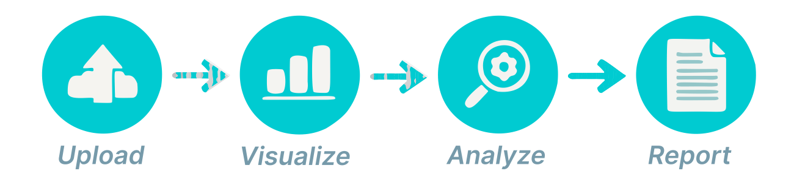

<p align="center">
  
</p>

<h1 align="center">Analyze Your Data</h1>

<p align="center">
  <strong>Interactive data analysis and visualization — all in your browser</strong>
</p>

<p align="center">
  <a href="https://github.com/zboardio/analyzeyourdata/blob/main/LICENSE"></a>
  <a href="https://github.com/zboardio/analyzeyourdata"></a>
  <a href="https://github.com/zboardio/analyzeyourdata"></a>
  
  
  
</p>

---

A free, open-source tool for interactive data analysis and visualization. Upload your data, explore it in a powerful grid, build charts, and export dashboards — no account needed, no data stored on the server.

Whether you're a data analyst exploring a dataset, a manager reviewing monthly reports, or a student working on a project — this tool gives you a full analysis workflow without installing anything or writing a single line of code.

## 🚀 How It Works

| Step | What you do |
|------|------------|
| **1. Load** | Drag & drop a file, paste a Google Sheets link, or connect to Airtable |
| **2. Explore** | Sort, filter, group, and pivot your data in a powerful AG Grid table |
| **3. Visualize** | Pick from 13 chart types, configure up to 3 independent charts |
| **4. Connect** | Filter data in the grid — **all charts update in real-time** |
| **5. Export** | Download charts as interactive HTML, or export grid data to CSV/Excel |

> 💡 **The core power:** Grid and charts are always in sync. Every filter, sort, or group action updates all charts instantly. Right-click the grid to export the exact data you see.

## 📁 Supported Data Sources

<table>
  <tr>
    <td><strong>📤 Direct Upload</strong></td>
    <td>Excel <code>.xlsx</code> <code>.xls</code> · CSV <code>.csv</code> <code>.txt</code> <code>.log</code> · JSON · Parquet · HDF5 · SQLite <code>.db</code> <code>.sqlite</code></td>
  </tr>
  <tr>
    <td><strong>📊 Google Sheets</strong></td>
    <td>Paste a public sharing link, optionally specify a sheet GID</td>
  </tr>
  <tr>
    <td><strong>🔗 Airtable</strong></td>
    <td>Connect with a Personal Access Token and Base ID</td>
  </tr>
</table>

## 📈 13 Chart Types

Scatter · Scatter (multi-Y) · Line · Bar (grouped) · Bar (stacked) · Histogram (grouped) · Histogram (stacked) · Pie · Bubble · Heatmap · Logarithmic · Sunburst · Icicle

Each chart is independently configurable with custom axes, colors, titles, and Z-axis parameters. Download individual charts or a combined dashboard as standalone interactive HTML files.

## 🕐 Datetime Intelligence

If your data contains a datetime column, the tool automatically generates useful time-based columns — year, month, day, weekday, calendar week, hour, and more. Group and chart by time periods without any manual preparation.

## 🌍 Available in 15 Languages

🇬🇧 English · 🇨🇿 Čeština · 🇩🇰 Dansk · 🇩🇪 Deutsch · 🇪🇸 Español · 🇫🇷 Français · 🇭🇷 Hrvatski · 🇮🇹 Italiano · 🇳🇱 Nederlands · 🇵🇱 Polski · 🇵🇹 Português · 🇸🇰 Slovenčina · 🇸🇮 Slovenščina · 🇸🇪 Svenska · 🇺🇦 Українська

Each language runs as an independent Docker container with fully translated UI, tooltips, and documentation.

## 🔒 Data Privacy

Your uploaded data stays in your browser session memory and is **never stored on the server**. No file contents, column names, or data values are logged. Closing the browser tab clears everything.

We only store voluntary feedback submissions and anonymous usage analytics (event types, file formats, row counts — never actual data). See [PRIVACY.md](PRIVACY.md) for the full policy.

## 🔍 Build Transparency

Every deployment includes a git commit hash visible in the footer, linking directly to the source code on GitHub. The `/api/version` endpoint returns the exact commit running in production — anyone can verify that the deployed app matches this public repository.

## 🛠️ Tech Stack

| Component | Version | Purpose |
|-----------|---------|---------|
| [Plotly Dash](https://dash.plotly.com) | 4.4.1 | Web framework |
| [AG Grid](https://www.ag-grid.com) | 33.3.3 | Interactive data grid (Community by default, Enterprise optional) |
| [Pandas](https://pandas.pydata.org) | 3.0.0 | Data processing |
| [Plotly](https://plotly.com/python/) | 6.0.0+ | Chart rendering |
| [MongoDB](https://www.mongodb.com) | — | Usage analytics |
| [Gunicorn](https://gunicorn.org) | 23.0.0+ | Production WSGI server |

**Architecture:** One Docker container per language, routed via Cloudflare Tunnel subdomains. All containers share the same codebase — differentiated only by the `APP_LANGUAGE` environment variable.

## 🐳 Self-Hosting

### Quick start — prebuilt image

A multi-arch image (`linux/amd64`, `linux/arm64`) is published to GitHub Container Registry:

```bash
docker run -d -p 8050:8050 -e APP_LANGUAGE=en ghcr.io/zboardio/analyzeyourdata:latest
```

Open http://localhost:8050. One container runs one language — set `APP_LANGUAGE` to any of:
`en` `cs` `da` `de` `es` `fr` `hr` `it` `nl` `pl` `pt` `sk` `sl` `sv` `uk`

Everything else is optional — with no further configuration you get a fully working instance with AG Grid Community and no analytics. For the full configuration reference, use an env file ([`.env.example`](.env.example) documents every option):

```bash
curl -o .env https://raw.githubusercontent.com/zboardio/analyzeyourdata/main/.env.example
docker run -d -p 8050:8050 --env-file .env ghcr.io/zboardio/analyzeyourdata:latest
```

Or with Docker Compose: see [`docker-compose.single.yml`](docker-compose.single.yml).

### AG Grid licensing (please read)

The public image ships **without** an AG Grid license key. The grid runs in one of three modes:

| Mode | How | What you get |
|------|-----|--------------|
| **Community** (default) | nothing to configure | Sorting, filtering, CSV export. MIT-licensed — free for any use, including commercial. No watermark. |
| **Enterprise, licensed** | set `AG_GRID_LICENSE_KEY` | Adds row grouping, pivoting, sidebar tool panels, and Excel export. |
| **Enterprise, evaluation** | set `AG_GRID_ENABLE_ENTERPRISE=true` (no key) | Same Enterprise features, but AG Grid shows a watermark and console errors. AG Grid permits this for **evaluation and development only** — using it in production is not licensed. Enabling it is your decision and your responsibility. |

There is **no free non-commercial tier** for AG Grid Enterprise — production use of Enterprise features always requires a [purchased license](https://www.ag-grid.com/license-pricing/). The instances hosted by zboardio run with a purchased license.

### From source

```bash
git clone https://github.com/zboardio/analyzeyourdata.git
cd analyzeyourdata
cp .env.example .env      # configure your settings
docker compose up app-en  # single English instance
docker compose up         # all 15 language instances
```

MongoDB is optional (feedback + anonymous usage analytics) — leave `MONGO_URI` empty to disable it.

## 🤝 Contributing

Contributions are welcome! The project uses Python 3.12+, Dash 4.4.1, and follows a modular callback architecture.

```bash
pip install -r requirements.txt
pip install pre-commit && pre-commit install  # enables gitleaks secret scanning on commits
python app.py  # starts on http://127.0.0.1:8050
```

See [`docs/`](docs/) for the full developer reference — project structure, callback patterns, environment variables, and i18n system.

## ⚠️ Known Limitations

- **Microsoft SharePoint / OneDrive** — Microsoft has disabled unauthenticated access to the OneDrive sharing API. Direct loading from SharePoint/OneDrive links is no longer supported. Download the file and use Direct File Upload instead.
- **Airtable** — Requires a Personal Access Token with `data.records:read` and `schema.bases:read` scopes.

## 📄 License

This project is licensed under the [MIT License](LICENSE).

---

<p align="center">
  Developed with care and respect to the time of others by <strong><a href="https://zboardio-webpage.pages.dev/en/#hero">zboardio</a></strong>
</p>
